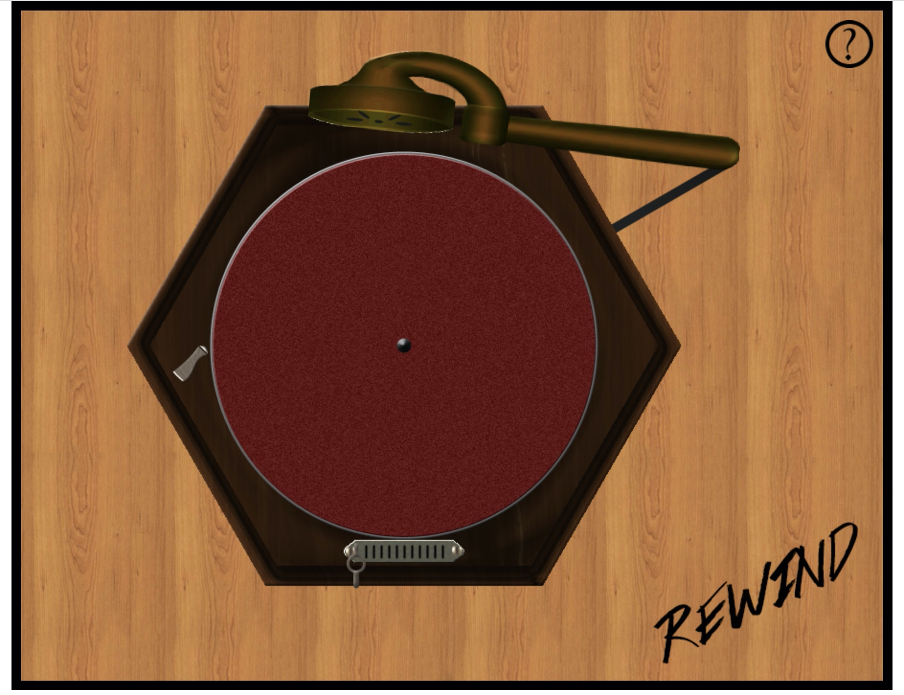

# REWIND - Gramophone

<p align="center">
  
</p>

## Description

This repository contains the source code of a web application that virtualizes a gramophone using the Web Audio API.
The project also uses web technologies such as: PHP, HTML5, CSS3 and jQuery.
This project provides the following features:

*  **Audio playback**:  you can play a track simply with the gramophone interface, you just need to load the disc from the track loader and play it by clicking on the gramophone handle placed in the left side;
*  **Volume Control**: during the playback of a track, you can adjust the volume of the audio with a dedicated slider;
* **Rotation Speed Control**: during  the playback of a track, you can also adjust the disc's rotation speed, i.e. the speed of audio playback, with a dedicated slider or through the available rotation presets;
* **Equalization Control**: the gramophone is also equipped with an equalizer with which you can arbitrarily change the equalization profile in real time while playing a track;
* **Arm Control**: you can use the mouse pointer to drag the gramophone's arm over the disc, in order to choose the time at which the playback starts.
* **Track Loader**: using the track loader you can manage the tracks of your collection: you can choose the next track to play and the tracks to delete, you can also replace the audio file associated to a track with a new audio file specified through the upload interface.
* **Upload/Download Area**: the gramophone is also equipped with an "Upload/Download Area" in which you can:
    * Import a single track;
    * Download the tracklist in JSON format;
    * Download all the tracks in a single zip file;
* **Waveform Visualization**: during the playback of a track, it is also possible to visualize the waveform of the audio; the waveform equips a header which tells you the position of the current playback;

## Installation
All the project files are in the "gramophone" folder. 

It is recommended to use a docker, you can find the `DockFile` under the `docker` folder.

To build a docker image, go inside the docker folder.

`$cd docker`

Build the image by typing

`$docker build -t [TAG] .`

You need to specify a tag name which identifies the image.

If you want to change the php configuration, you need to edit the `php.ini` inside the docker folder and rebuild the image.

## Usage
Go to the root folder of the project i.e. ~/PATH_TO/rewind_gramophone/

then run the docker

`$ docker run --rm -it -p [PORT]:80 -v $PWD:/var/www/html [TAG]`

Then, open the browser at this address:
```
http://localhost:PORT/gramophone/gramoPlayer.php
```
Where:
* [PORT]: is the port of the web server you specified.
* [TAG]: is the image tag name you specified before.

## Credits
This is the second version of the software developed by [*Niccolò Pretto*](http://www.dei.unipd.it/~prettoni/) under the supervision of Sergio Canazza [1,2]. 

In this new version, several features are implemented. The developers who partecipate to this update (under the supervision of [*Niccolò Pretto*](http://www.dei.unipd.it/~prettoni/)) are: 
* _Riccardo Galiazzo_
* _Fabio Giachelle_
* _Luca Piazzon_
* _Giovanni Candeo_
* _Daohong Li_

The repository includes snippets of code and algorithms from the following repositories:
* **getID3**: https://github.com/JamesHeinrich/getID3
* **peaks.js**: https://github.com/bbc/peaks.js

## References

[1] C. Fantozzi, F. Bressan, N. Pretto, and S. Canazza. "Tape music archives: from preservation to access". *International Journal on Digital Libraries*, 18(3):233–249, September 2017. ISSN 1432-1300. doi: 10.1007/s00799-017-0208-8.

[2] N. Pretto and S. Canazza. "REWIND: Simulazione di un’esperienza d’ascolto storicamente fedele di dischi fonografici digitalizzati". *In Proceedings of the XX Colloquium of Musical Informatics, (CIM’14)*, pages 29–34, Roma, Italy, October 2014.

